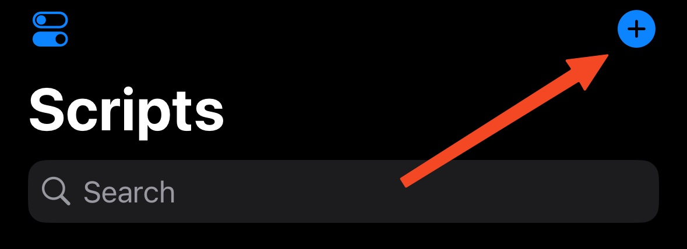
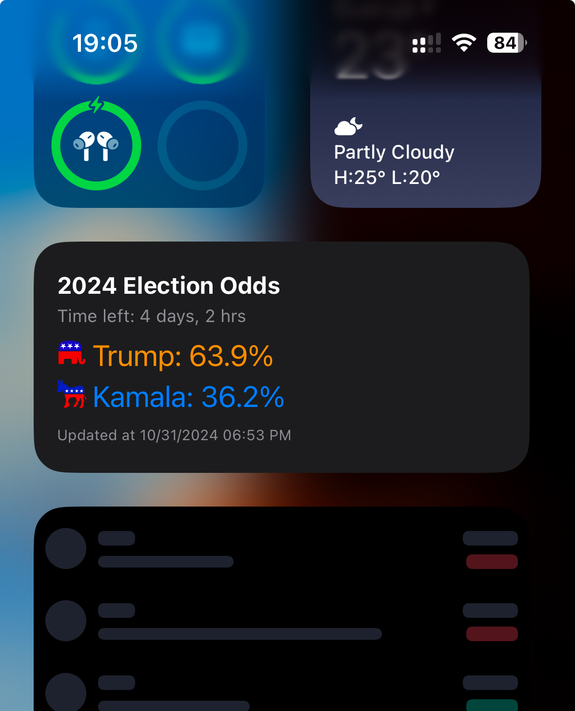

# Polymarket Widgets
The goal of this repository is to share Polymarket Widgets that display the odds of certain markets, through Scriptable (iOS only).

For now, there's only the 2024 Election Odds widget available, but more will come in due time (or through requests). It's also quite simple to customize if you have some programming knowledge (I'm a total noob myself btw).

*Note : the data refresh rate for the widget is mostly controlled by iOS (I'm open to solutions)*

# 2024 Election Odds
This widget displays the odds for the ongoing U.S. election. It displays the time left until the 5th of November, each candidate's odds, and the last data update time for accuracy (which depends on iOS).

## How to use it

### Download Scriptable
First of all, you should download the [Scriptable](https://scriptable.app/) app on iOS.

### Then, create a new script
Creata a new script in Scriptable by clicking on the "+" button on the top right corner

### Paste the content
Paste the content of the [2024 elections odds](https://github.com/0xNoe/polymarket-widgets/blob/main/2024-election-odds) file inside it.

Then, by clicking on the two slides button in the bottom left corner, you can give your script a name, logo etc.

### Add the widget
Now, go to your home page, add a widget, search for Scriptable and add the app widget. After doing that, you'll see that you need to click on it in order to configure the script to be displayed in that widget. Once you select the script you've just created, it's done !

